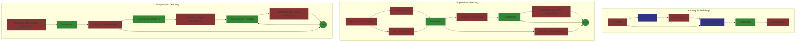

# ijo-toki-ante

```mermaid
graph TB;
    classDef Tool fill:#338,stroke:#fff;
    classDef Data fill:#833,stroke:#fff;
    classDef ML fill:#383,stroke:#fff;

    subgraph Learning Embeddings
        V[Vocabulary]:::Data;
        WIN[Text Windows]:::Tool;
        EMB[Embedder]:::ML;
        TOK[Tokenizer]:::Tool;
        E[Embeddings]:::Data;
        D1[Text Data]:::Data;
        
        D1 --> TOK --> V --> WIN --> EMB --> E;
        D1 --> WIN;
    end;

    subgraph Supervised Learning
        TD2[Texts with Translation]:::Data;
        TP2[Toki Pona Texts]:::Data;
        TE2[English Texts]:::Data;
        
        EMB2[Embedder]:::ML;
        EE2[English Embeddings]:::Data;
        ET2[Toki Pona Embeddings]:::Data;
        EET2[Estimated Toki Pona Embeddings]:::Data;

        TRA2[Transformer]:::ML;
        L2((Loss)):::ML;

        TD2 --> TE2 & TP2 --> EMB2 --> EE2 & ET2;
        EE2 --> TRA2 --> EET2 --> L2;
        ET2 --> L2;
        L2 --> TRA2;
    end;

    subgraph Unsupervised Learning
        TP3[Toki Pona Texts without Translation]:::Data;
        EMB3[Embedder]:::ML;
        ET3[Toki Pona Embeddings]:::Data;
        EET3[Estimated Toki Pona Embeddings]:::Data;
        TRATE3[Transformer TP2ENG]:::ML;
        EEE3[Estimated English Embeddings]:::Data;
        TRAET3[Transformer TP2ENG]:::ML;
        L3((Loss)):::ML;

        TP3 --> EMB3 --> ET3;

        ET3 --> TRATE3 --> EEE3 --> TRAET3 --> EET3 --> L3;
        ET3 --> L3;
        L3 --> TRAET3;
    end;
    
```